# Algoritmos de Ordenação

### Teste de Mesa - Bubble Sort

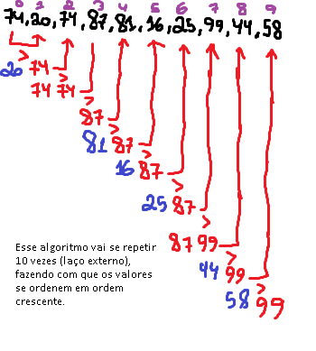
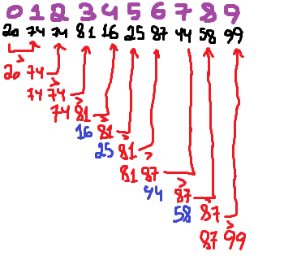
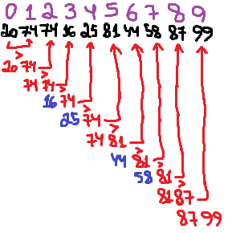
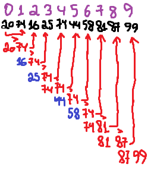
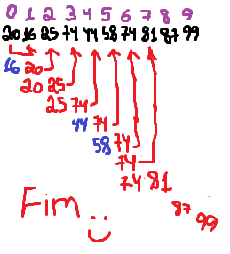

+ 5 rodadas para bubble sort no vetor 1.

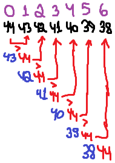
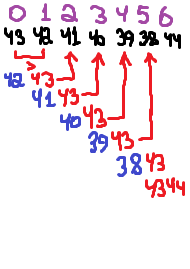
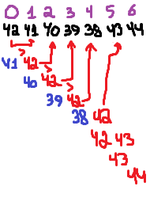
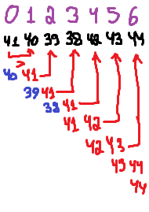
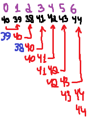
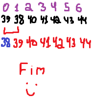

+ 6 rodadas para bubble sort no vetor 2.

+ 4 rodadas para bubble sort no vetor 3. + [Teste de mesa no excel](https://docs.google.com/spreadsheets/d/1ubJARKjweZnO_Kh166BXH7Tmo7DoklLi/edit?usp=drive_link&rtpof=true&sd=true)

### Teste de mesa - Merge Sort
+ 9 rodadas para merge sort no vetor 1.
+ 5 rodadas para merge sort no vetor 2.
+ 10 rodadas para merge sort no vetor 3.
+ [Teste de mesa no excel](https://docs.google.com/spreadsheets/d/1kyGHGIP9Zke3JPK_ZUQ8CrqXBn53ffSV/edit?usp=drive_link&ouid=117811544773146152975&rtpof=true&sd=true)

## Projeto com as duas bibliotecas de ordenação.
+ [Merge e BubbleSort](https://github.com/Bieelogrom/BibliotecasDeOrdenacao)
+ [Shell e SelectionSort](https://github.com/Bieelogrom/BibliotecasDeOrdenacao2)
